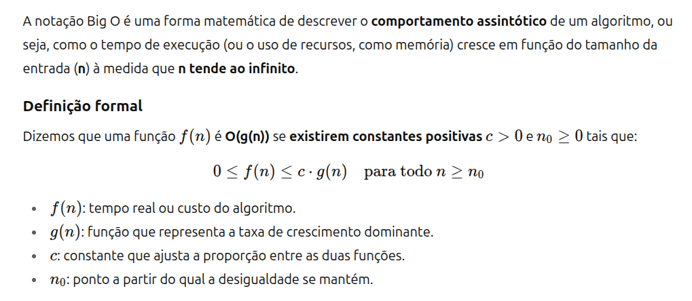

# Aula 01 - 21/08

## Conhecendo a turma

--- 

### Resumo prof. Francisco Elanio

* Trabalhando com listas (for e while), lista dentro de lista
* Estrutura com filas e pilhas (exemplos com lista dentro de lista)
* Estrutura utilizando operadores com conjuntos
* Busca Linear e Binária
* Estrutura com Merge e Quick Sort
* Estruturas com grafos

### Aula Sobre Recursão

* [Slides prof. Francisco](./Aula2-Recursao.pdf) (Recursão)

### Notações O, Omega e Theta

