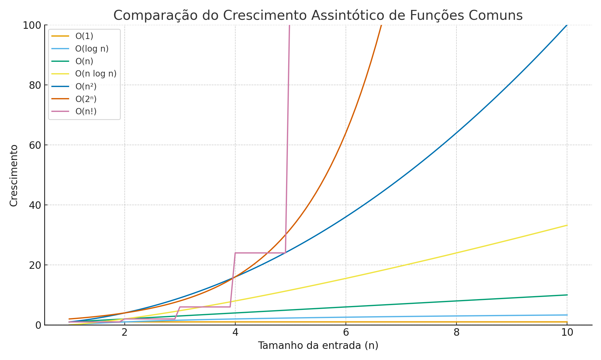

# Aula 02 - 28/08

---

 # Crescimento Assintótico de funções na Análise de Complexidade de Algoritmos

O crescimento assintótico descreve como o tempo de execução (ou uso de recursos) de um algoritmo se comporta **à medida que o tamanho da entrada cresce indefinidamente (n → ∞)**. Ele abstrai fatores constantes e termos menos relevantes, permitindo a comparação objetiva entre algoritmos.

---

# Definição da Notação O (Big-O)

A notação **Big-O** descreve um **limite superior assintótico** para o crescimento de uma função. É usada para representar o pior caso de tempo de execução ou consumo de recursos de um algoritmo quando o tamanho da entrada cresce indefinidamente.

## Definição Formal

Dizemos que uma função \( f(n) \) é **O(g(n))** se existem **constantes positivas** \( c > 0 \) e \( n_0 \geq 1 \) tais que:

\[
0 \leq f(n) \leq c \cdot g(n), \quad \forall n \geq n_0
\]

### Interpretação

- \( f(n) \) é a função real de custo/tempo do algoritmo.
- \( g(n) \) é a função de referência que descreve o crescimento esperado.
- \( c \) é um fator constante que multiplica \( g(n) \) para garantir que ele sempre seja um limite superior para \( f(n) \) a partir de \( n_0 \).
- \( n_0 \) é o ponto a partir do qual a desigualdade é sempre válida.

### Exemplo

Se \( f(n) = 5n^2 + 3n + 10 \), podemos provar que:

\[
f(n) \leq 6n^2, \quad \forall n \geq 1
\]

Portanto, \( f(n) \) é **O(n²)**.

---

## Intuição

- Big-O **ignora constantes e termos menos significativos**, pois eles se tornam irrelevantes para \( n \to \infty \).
- Representa um **limite superior**, ou seja, a complexidade não crescerá mais rápido do que \( g(n) \) dentro de um fator constante.

---

## Principais Notações Assintóticas

1. **O (Big-O)**  
   - Limite superior do crescimento.  
   - Responde: *"Qual é o pior caso?"*  
   - Exemplo: `5n² + 3n + 10` → **O(n²)**

2. **Ω (Ômega)**  
   - Limite inferior.  
   - Responde: *"Qual é o melhor caso?"*  
   - Exemplo: Algoritmo executa pelo menos `2n` operações → **Ω(n)**

3. **Θ (Teta)**  
   - Limite exato de crescimento.  
   - Responde: *"Como ele cresce em geral?"*  
   - Exemplo: Limitado por cima e por baixo por `c·n²` → **Θ(n²)**

4. **o (o pequeno)**  
   - Limite superior **não apertado** (cresce mais devagar que outra função).  
   - Exemplo: `n` é `o(n²)`

5. **ω (ômega pequeno)**  
   - Limite inferior **não apertado** (cresce mais rápido que outra função).  
   - Exemplo: `n²` é `ω(n)`

---

## Aplicação na Análise de Algoritmos

- Prever desempenho para entradas muito grandes.  
- Ignorar detalhes específicos de hardware e implementação.  
- Comparar algoritmos de diferentes naturezas (ex.: `O(n log n)` vs `O(n²)`).

---

## Exemplos de Crescimento Comum

- **O(1)**: constante  
- **O(log n)**: logarítmico (ex.: busca binária)  
- **O(n)**: linear  
- **O(n log n)**: quase linear (ex.: mergesort, heapsort)  
- **O(n²)**: quadrático (ex.: bubble sort, selection sort)  
- **O(2ⁿ)**: exponencial  
- **O(n!)**: fatorial (ex.: força bruta para o problema do caixeiro viajante)

